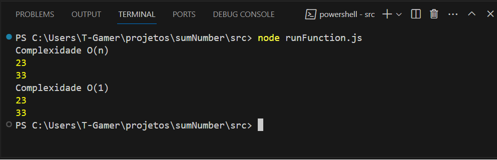
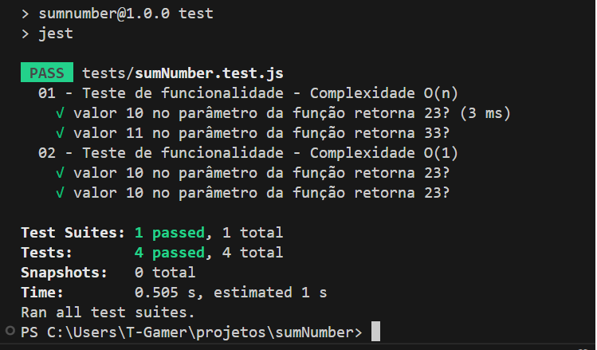

# Função sumNumber

### Descrição:
- Implemente uma função que receba um número inteiro positivo e retorne o somatório de todos os valores
inteiros divisíveis por 3 ou 5 que sejam inferiores ao número passado.

### Exemplos: <br>

1 - Caso sua função receba o inteiro 10, ela deve retornar `23`, resultante do somatório dos números 3, 5, 6 e
9 que são menores que 10.

2 - Caso sua função receba o inteiro 11, ela deve retornar `33`, resultante do somatório dos números 3, 5, 6, 9
e 10 que são menores que 11.


### Como executar o projeto


1 - Clone o repositório `em sua máquina`

```bash
git clone git@github.com:ThiagoDRangel/sumNumber.git
```

2 - Instale as dependências

```bash
npm install
```

3 - Acesse a pasta `src`
```bash
cd sumNumber/src
```

4 - Execute o arquivo principal `runFunction.js`

```bash
node src/runFunction.js
```

### Saída esperada




### Testando a aplicação com a biblioteca `Jest`

```bash
npm test
```

### Saída esperada

